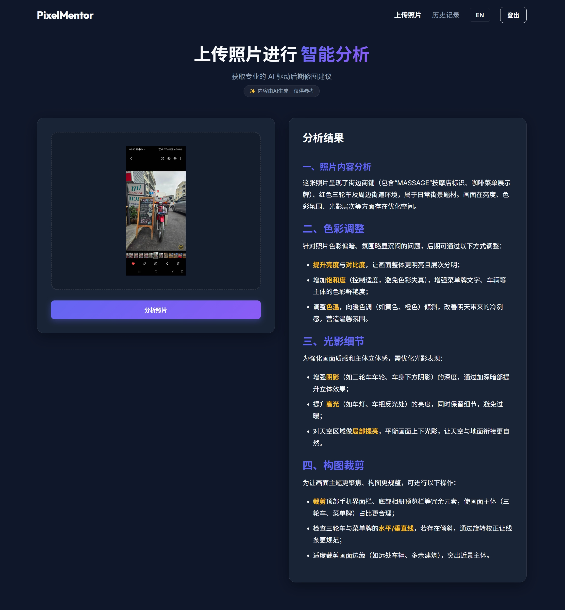

# PixelMentor 📸✨

> An elegant, AI-driven web application that analyzes your photos and provides professional post-processing (retouching) suggestions.

**PixelMentor (像素导师)** allows users to upload their photography and leverages the power of advanced Vision-Language Models (like GLM-4V) to perform deep analysis. It provides immediate, structured, and actionable post-processing advice focusing on Color, Lighting, and Composition.

<div align="center">
  
  <br><br>
  
</div>

## 🌟 Features

- **Upload & Analyze**: Drag and drop your photos to get instant AI feedback.
- **Smart Image Compression**: Client-side image resizing ensures fast uploads and prevents API timeouts without sacrificing analysis quality.
- **Bilingual Support (i18n)**: Seamlessly switch between English and Chinese (中文) UI and AI output.
- **Markdown Rendering**: Beautifully formatted AI suggestions with syntax highlighting for keywords and parameters.
- **History Tracking**: Securely saves your past analysis history to a MongoDB database for future reference.
- **Authentication**: Custom, lightweight JWT-based login and registration system.
- **Modern UI/UX**: Premium dark-mode interface built with Vanilla CSS, featuring glassmorphism, background blobs, and micro-animations.

## 🛠️ Tech Stack

- **Frontend**: Next.js 14 (App Router), React, Vanilla CSS
- **Backend**: Next.js API Routes, Node.js
- **Database**: MongoDB (Mongoose)
- **Authentication**: JWT (`jose`), `bcryptjs`
- **AI Integration**: OpenAI SDK via GLM-4.1V-Thinking-Flash
- **Markdown**: `react-markdown`, `remark-gfm`

## 🚀 Getting Started

### Prerequisites

- Node.js 18.x or later
- MongoDB instance (Local or Atlas)
- An active API key for the GLM Vision model (or compatible OpenAI-format vision endpoint)

### Installation

1. **Clone the repository**
   ```bash
   git clone https://github.com/yourusername/pixelmentor.git
   cd pixelmentor
   ```

2. **Install dependencies**
   ```bash
   npm install
   ```

3. **Environment Setup**
   Create a `.env.local` file in the root directory and add your keys:
   ```env
   MONGODB_URI=mongodb+srv://<username>:<password>@cluster.mongodb.net/pixelmentor?retryWrites=true&w=majority
   GLM_API_KEY=your_glm_api_key_here
   JWT_SECRET=your_super_secret_jwt_key
   ```

4. **Run the Development Server**
   ```bash
   npm run dev
   ```
   Open [http://localhost:3000](http://localhost:3000) with your browser to see the result.

## 🤝 Contributing

Contributions, issues, and feature requests are welcome!

## 📄 License

This project is licensed under the MIT License.
